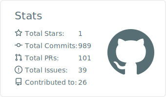
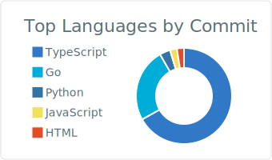
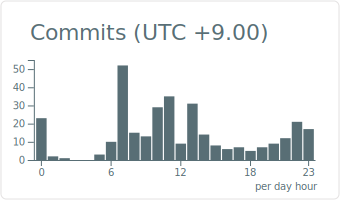

# y-maeda1116

<!-- PROFILE_CARDS -->

<!-- /PROFILE_CARDS -->

## Repository Status

<!-- REPO_STATUS_TABLE -->
| Repository | Latest Release | Build Status |
|---|---|---|
| [Weekly-Task-Board](https://github.com/y-maeda1116/Weekly-Task-Board) | `N/A` |  |
| [security-base](https://github.com/y-maeda1116/security-base) | `N/A` |  |
| [my-github-config](https://github.com/y-maeda1116/my-github-config) | `N/A` |  |
| [apple-refurb-discord-notify](https://github.com/y-maeda1116/apple-refurb-discord-notify) | `N/A` |  |
<!-- /REPO_STATUS_TABLE -->

## Recent Activity

<!-- RECENT_COMMITS -->
<!-- /RECENT_COMMITS -->

## Current Focus

<!-- CURRENT_FOCUS -->
Recently active in 1 repos — working with **JavaScript**, **TypeScript**, **HTML**, **CSS**, **Shell**
<!-- /CURRENT_FOCUS -->
