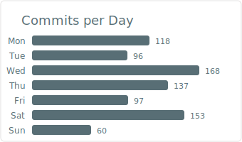

# y-maeda1116

<!-- PROFILE_CARDS -->

<!-- /PROFILE_CARDS -->

## Repository Status

<!-- REPO_STATUS_TABLE -->
| Repository | Latest Release | Build Status | Open Issues | Open PRs |
|---|---|---|---|---|
| [bean-watcher](https://github.com/y-maeda1116/bean-watcher) | `N/A` |  | 0 | 0 |
| [kuku19-master](https://github.com/y-maeda1116/kuku19-master) | `N/A` |  | 0 | 0 |
| [sumida-stream-coffee](https://github.com/y-maeda1116/sumida-stream-coffee) | `N/A` |  | 0 | 0 |
| [Weekly-Task-Board](https://github.com/y-maeda1116/Weekly-Task-Board) | `N/A` |  | 0 | 0 |
| [jre-green-trip](https://github.com/y-maeda1116/jre-green-trip) | `N/A` |  | 1 | 0 |
| [security-base](https://github.com/y-maeda1116/security-base) | `N/A` |  | 1 | 0 |
| [go-shichi-go](https://github.com/y-maeda1116/go-shichi-go) | `N/A` |  | 0 | 0 |
| [python-template-base](https://github.com/y-maeda1116/python-template-base) | `N/A` |  | 0 | 1 |
| [Playful-Learning-Hub](https://github.com/y-maeda1116/Playful-Learning-Hub) | `N/A` |  | 15 | 1 |
| [pack-and-go](https://github.com/y-maeda1116/pack-and-go) | `N/A` |  | 0 | 0 |
| [habit-tracker-pwa](https://github.com/y-maeda1116/habit-tracker-pwa) | `N/A` |  | 0 | 0 |
| [kaminarimon-lunch-map](https://github.com/y-maeda1116/kaminarimon-lunch-map) | `N/A` |  | 0 | 0 |
| [tenki-fuku-bot](https://github.com/y-maeda1116/tenki-fuku-bot) | `N/A` |  | 0 | 0 |
| [ts-template-base](https://github.com/y-maeda1116/ts-template-base) | `N/A` |  | 0 | 0 |
| [games](https://github.com/y-maeda1116/games) | `N/A` |  | 0 | 0 |
| [apple-refurb-discord-notify](https://github.com/y-maeda1116/apple-refurb-discord-notify) | `N/A` |  | 0 | 0 |
| [divination-journal](https://github.com/y-maeda1116/divination-journal) | `N/A` |  | 0 | 0 |
| [template-go-cross](https://github.com/y-maeda1116/template-go-cross) | `N/A` |  | 0 | 0 |
| [discord-trans-helper](https://github.com/y-maeda1116/discord-trans-helper) | `N/A` |  | 0 | 0 |
<!-- /REPO_STATUS_TABLE -->

## Recent Activity

<!-- RECENT_COMMITS -->
- `kuku19-master` — Merge pull request #2 from y-maeda1116/feat/kuku19-spa (_2026-07-07_)
- `Weekly-Task-Board` — Merge pull request #55 from y-maeda1116/chore/upgrade-vitest-4.1.9-node-26 (_2026-07-07_)
- `jre-green-trip` — Merge pull request #14 from y-maeda1116/dependabot/github_actions/golangci/golangci-lint-action-9.3.0 (_2026-07-06_)
<!-- /RECENT_COMMITS -->

## Current Focus

<!-- CURRENT_FOCUS -->
Recently active in 6 repos — working with **TypeScript**, **JavaScript**, **HTML**, **CSS**, **Go**
<!-- /CURRENT_FOCUS -->
