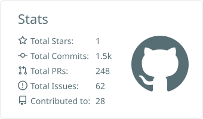
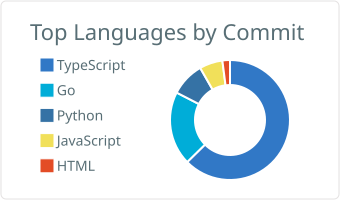
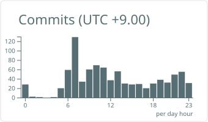
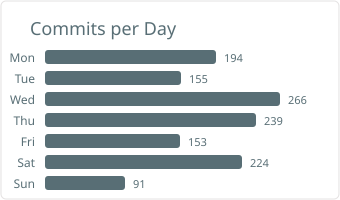

# y-maeda1116

<!-- PROFILE_CARDS -->

<!-- /PROFILE_CARDS -->

## Repository Status

<!-- REPO_STATUS_TABLE -->
| Repository | Latest Release | Build Status | Open Issues | Open PRs |
|---|---|---|---|---|
| [go-shichi-go](https://github.com/y-maeda1116/go-shichi-go) | `N/A` |  | [0](https://github.com/y-maeda1116/go-shichi-go/issues) | [0](https://github.com/y-maeda1116/go-shichi-go/pulls) |
| [bean-watcher](https://github.com/y-maeda1116/bean-watcher) | `N/A` |  | [0](https://github.com/y-maeda1116/bean-watcher/issues) | [0](https://github.com/y-maeda1116/bean-watcher/pulls) |
| [divination-journal](https://github.com/y-maeda1116/divination-journal) | `N/A` |  | [0](https://github.com/y-maeda1116/divination-journal/issues) | [0](https://github.com/y-maeda1116/divination-journal/pulls) |
| [ts-template-base](https://github.com/y-maeda1116/ts-template-base) | `N/A` |  | [0](https://github.com/y-maeda1116/ts-template-base/issues) | [0](https://github.com/y-maeda1116/ts-template-base/pulls) |
| [kuku19-master](https://github.com/y-maeda1116/kuku19-master) | `N/A` |  | [0](https://github.com/y-maeda1116/kuku19-master/issues) | [0](https://github.com/y-maeda1116/kuku19-master/pulls) |
| [tokyo-hidden-transfers](https://github.com/y-maeda1116/tokyo-hidden-transfers) | `N/A` |  | [0](https://github.com/y-maeda1116/tokyo-hidden-transfers/issues) | [0](https://github.com/y-maeda1116/tokyo-hidden-transfers/pulls) |
| [security-base](https://github.com/y-maeda1116/security-base) | `N/A` |  | [0](https://github.com/y-maeda1116/security-base/issues) | [0](https://github.com/y-maeda1116/security-base/pulls) |
| [jre-green-trip](https://github.com/y-maeda1116/jre-green-trip) | `N/A` |  | [0](https://github.com/y-maeda1116/jre-green-trip/issues) | [0](https://github.com/y-maeda1116/jre-green-trip/pulls) |
| [29cm-less-than-30](https://github.com/y-maeda1116/29cm-less-than-30) | `N/A` |  | [0](https://github.com/y-maeda1116/29cm-less-than-30/issues) | [0](https://github.com/y-maeda1116/29cm-less-than-30/pulls) |
| [pack-and-go](https://github.com/y-maeda1116/pack-and-go) | `N/A` |  | [0](https://github.com/y-maeda1116/pack-and-go/issues) | [0](https://github.com/y-maeda1116/pack-and-go/pulls) |
| [sumida-stream-coffee](https://github.com/y-maeda1116/sumida-stream-coffee) | `N/A` |  | [0](https://github.com/y-maeda1116/sumida-stream-coffee/issues) | [0](https://github.com/y-maeda1116/sumida-stream-coffee/pulls) |
| [math-training-kids](https://github.com/y-maeda1116/math-training-kids) | `N/A` |  | [0](https://github.com/y-maeda1116/math-training-kids/issues) | [0](https://github.com/y-maeda1116/math-training-kids/pulls) |
| [habit-tracker-pwa](https://github.com/y-maeda1116/habit-tracker-pwa) | `N/A` |  | [0](https://github.com/y-maeda1116/habit-tracker-pwa/issues) | [0](https://github.com/y-maeda1116/habit-tracker-pwa/pulls) |
| [Playful-Learning-Hub](https://github.com/y-maeda1116/Playful-Learning-Hub) | `N/A` |  | [0](https://github.com/y-maeda1116/Playful-Learning-Hub/issues) | [0](https://github.com/y-maeda1116/Playful-Learning-Hub/pulls) |
| [Weekly-Task-Board](https://github.com/y-maeda1116/Weekly-Task-Board) | `N/A` |  | [0](https://github.com/y-maeda1116/Weekly-Task-Board/issues) | [0](https://github.com/y-maeda1116/Weekly-Task-Board/pulls) |
| [python-template-base](https://github.com/y-maeda1116/python-template-base) | `N/A` |  | [0](https://github.com/y-maeda1116/python-template-base/issues) | [0](https://github.com/y-maeda1116/python-template-base/pulls) |
| [kaminarimon-lunch-map](https://github.com/y-maeda1116/kaminarimon-lunch-map) | `N/A` |  | [0](https://github.com/y-maeda1116/kaminarimon-lunch-map/issues) | [0](https://github.com/y-maeda1116/kaminarimon-lunch-map/pulls) |
| [tenki-fuku-bot](https://github.com/y-maeda1116/tenki-fuku-bot) | `N/A` |  | [0](https://github.com/y-maeda1116/tenki-fuku-bot/issues) | [0](https://github.com/y-maeda1116/tenki-fuku-bot/pulls) |
| [games](https://github.com/y-maeda1116/games) | `N/A` |  | [0](https://github.com/y-maeda1116/games/issues) | [1](https://github.com/y-maeda1116/games/pulls) |
| [apple-refurb-discord-notify](https://github.com/y-maeda1116/apple-refurb-discord-notify) | `N/A` |  | [0](https://github.com/y-maeda1116/apple-refurb-discord-notify/issues) | [0](https://github.com/y-maeda1116/apple-refurb-discord-notify/pulls) |
| [template-go-cross](https://github.com/y-maeda1116/template-go-cross) | `N/A` |  | [0](https://github.com/y-maeda1116/template-go-cross/issues) | [0](https://github.com/y-maeda1116/template-go-cross/pulls) |
| [discord-trans-helper](https://github.com/y-maeda1116/discord-trans-helper) | `N/A` |  | [0](https://github.com/y-maeda1116/discord-trans-helper/issues) | [0](https://github.com/y-maeda1116/discord-trans-helper/pulls) |
<!-- /REPO_STATUS_TABLE -->

## Recent Activity

<!-- RECENT_COMMITS -->
- `go-shichi-go` — Merge pull request #49 from y-maeda1116/refactor/migrate-oxlint (_2026-09-12_)
- `go-shichi-go` — refactor: eslint から oxlint へ移行し TypeScript 7 へ更新 (_2026-09-12_)
- `go-shichi-go` — Merge pull request #40 from y-maeda1116/dependabot/npm_and_yarn/types/react-19.2.18 (_2026-09-12_)
<!-- /RECENT_COMMITS -->

## Current Focus

<!-- CURRENT_FOCUS -->
Recently active in 13 repos — working with **TypeScript**, **JavaScript**, **HTML**, **CSS**, **Go**
<!-- /CURRENT_FOCUS -->
